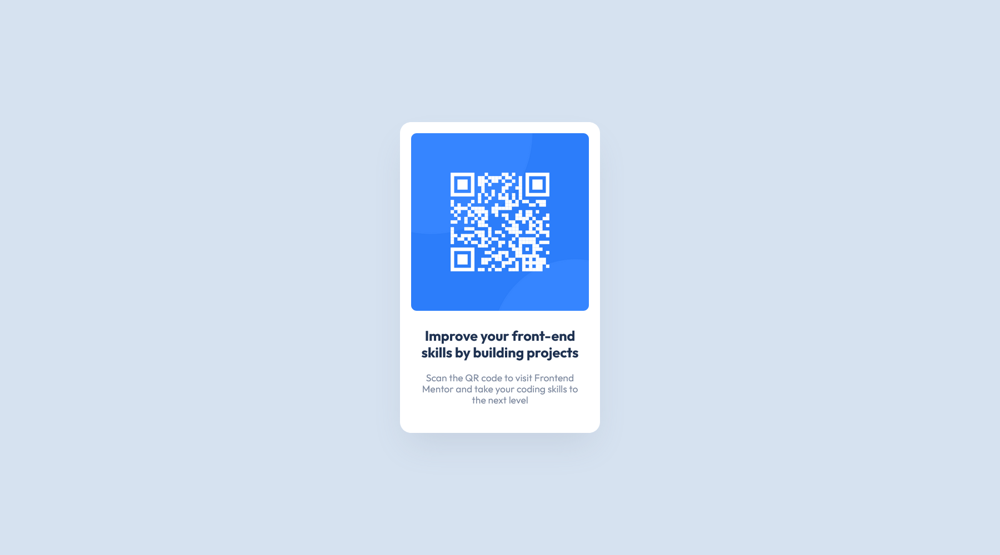
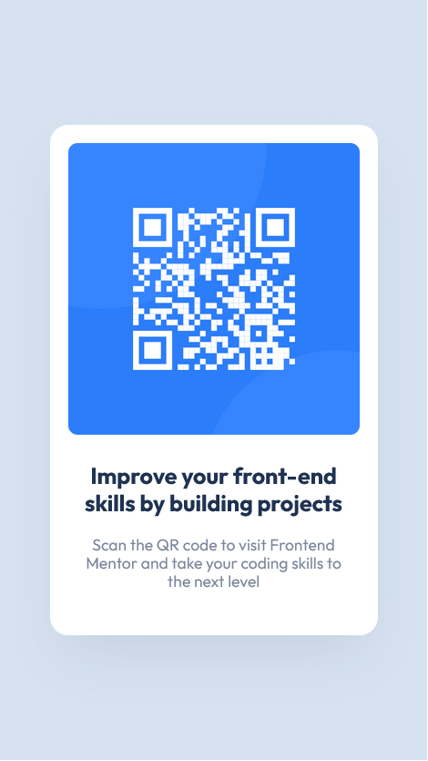

# QR Code Component Challenge

## Table of Contents

- [Description](#description)
- [Demo](#demo)
- [Screenshots](#screenshots)
- [Installation](#installation)
- [Technologies Used](#technologies-used)
- [Contact](#contact)

## Description

This repository contains my solution to the Frontend Mentor challenge to create a single-page website that displays a QR code component. The challenge was a great opportunity to practice and enhance my frontend development skills.

## Demo

[Link to Demo](https://souhil-qr-component.netlify.app)

## Screenshots

### Desktop


### Mobile


## Installation

To run this project locally, follow these steps:

1. Clone the repository to your local machine.
   ```bash
   git clone https://github.com/your-username/qr-component.git

2. Change the directory to the cloned repository.
   ```bash
   cd qr-component

3. Install the packages.
   ```bash
   npm install

4. Run the project.
   ```bash
   npm run dev

## Technologies Used

  - React + Vite

## Contact

**Email :e-mail:**: souhitheman@gmail.com


Happy coding!